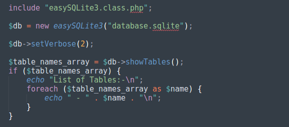

# easySQLite3

<sub>[easySQLite3 v0.1.0 (Beta)]</sub>

easySQLite3 is a PHP class that makes talking to SQLite3 Database easier, and it takes care of prepared statements to securely communicate with the database and prevent SQL-Injections.

`NOTE:` This Class is still in Beta release. Please don't use this release in a production system.



## Install

Simply download the class `easySQLite3.class.php` to your application directory, then include the class in your code.

```php
<?php

include "easySQLite3.class.php";

?>
```

Full documentation on how to use the class is in the [Wiki](wiki)

## License

Copyright (C) 2020  Ayoob Ali

This program is free software: you can redistribute it and/or modify it under the terms of the GNU General Public License as published by the Free Software Foundation, either version 3 of the License, or (at your option) any later version.

This program is distributed in the hope that it will be useful, but WITHOUT ANY WARRANTY; without even the implied warranty of MERCHANTABILITY or FITNESS FOR A PARTICULAR PURPOSE.  See the GNU General Public License for more details.

You should have received a copy of the GNU General Public License along with this program. If not, see <https://www.gnu.org/licenses/>

## ToDo

- Add automated data encryption for all communications.
- Add an option to automatically backup the database.
- Option to Encrypt the database before disconnecting, and decrypt when connecting using AES Encryption.

## Change Log

[2020-04-11] v0.1.0 (Beta):

- First Beta Release.
